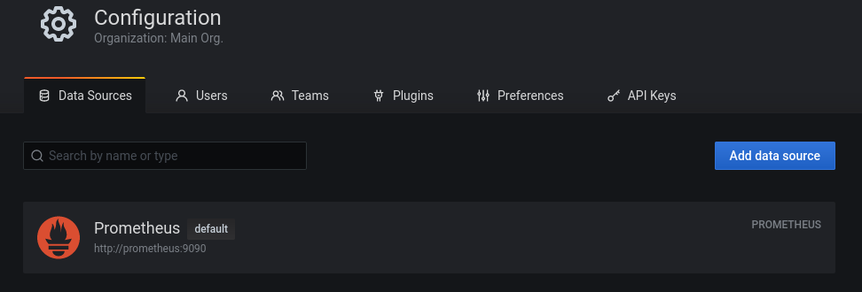
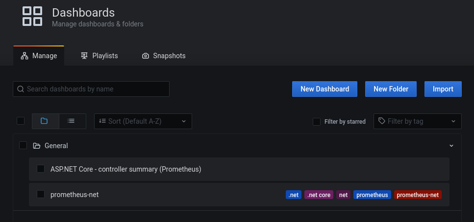
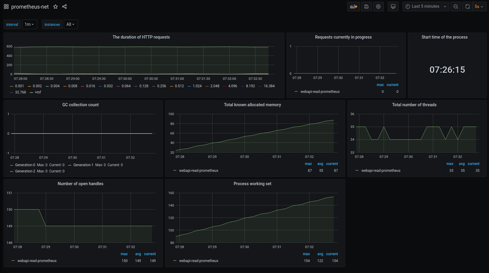
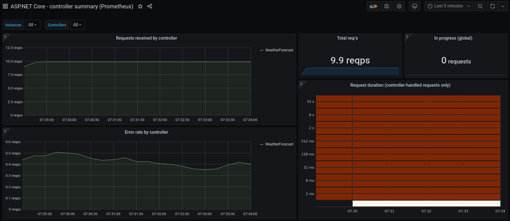

# AspNetCore.Prometheus

<a href="https://docs.microsoft.com/en-us/aspnet/core/?view=aspnetcore-3.1"></a>
<a href="https://prometheus.io/"></a>
<a href="https://grafana.com/"></a>
<a href="https://topswagcode.com/"></a>

This project is made to show how you could implement some good monitoring of your Website / WebAPI / App. This will be achieved using Prometheus sprinkled with some Grafana on top.

* Prometheus is a free software application used for event monitoring and alerting. It records real-time metrics in a time series database built using a HTTP pull model, with flexible queries and real-time alerting. 
* Grafana is a multi-platform open source analytics and interactive visualization web application. It provides charts, graphs, and alerts for the web when connected to supported data sources.


# Getting started

## AspNetCore

To get started we need some way to start recording metrics in AspNetCore app for prometheus to fetch. Good for us there are some awesome packages for that. Just add the following 2 packages:

```bash
$ dotnet add package prometheus-net
$ dotnet add package prometheus-net.AspNetCore
```

Then we can start using them in Startup like so:

```csharp
app.UseMetricServer();
app.UseHttpMetrics();
```

* UseMetricServer adds a simple /metrics endpoint and basic metrics (Ram, CPU etc)
* UseHttpMetrics adds, you guesed it. Http Metrics. Status codes, path, time taken, etc.

Below here here you can see some basic output for the sample project WeatherForecast:

```metrics
process_private_memory_bytes 266510336
process_open_handles 150
process_cpu_seconds_total 1.8
dotnet_total_memory_bytes 11681440
process_start_time_seconds 1600838775.19
http_request_duration_seconds_sum{code="200",method="GET",controller="WeatherForecast",action="Get"} 0.1042769000000001
http_request_duration_seconds_count{code="200",method="GET",controller="WeatherForecast",action="Get"} 356
http_request_duration_seconds_bucket{code="200",method="GET",controller="WeatherForecast",action="Get",le="0.001"} 350
http_request_duration_seconds_bucket{code="200",method="GET",controller="WeatherForecast",action="Get",le="0.002"} 355
http_request_duration_seconds_bucket{code="200",method="GET",controller="WeatherForecast",action="Get",le="0.004"} 355
http_request_duration_seconds_bucket{code="200",method="GET",controller="WeatherForecast",
action="Get",le="16.384"} 356
http_request_duration_seconds_bucket{code="200",method="GET",controller="WeatherForecast",action="Get",le="32.768"} 356
http_request_duration_seconds_bucket{code="200",method="GET",controller="WeatherForecast",action="Get",le="+Inf"} 356
http_request_duration_seconds_sum{code="500",method="GET",controller="WeatherForecast",action="Get"} 0.049069100000000004
http_request_duration_seconds_count{code="500",method="GET",controller="WeatherForecast",action="Get"} 14
http_request_duration_seconds_bucket{code="500",method="GET",controller="WeatherForecast",action="Get",le="0.001"} 0
http_request_duration_seconds_bucket{code="500",method="GET",controller="WeatherForecast",action="Get",le="0.002"} 7
http_request_duration_seconds_bucket{code="500",method="GET",controller="WeatherForecast",action="Get",le="0.004"} 13
http_request_duration_seconds_bucket{code="500",method="GET",controller="WeatherForecast",action="Get",le="0.008"} 13
http_request_duration_seconds_bucket{code="500",method="GET",controller="WeatherForecast",action="Get",le="0.016"} 13
http_request_duration_seconds_bucket{code="500",method="GET",controller="WeatherForecast",action="Get",le="0.032"} 14
http_request_duration_seconds_bucket{code="500",method="GET",controller="WeatherForecast",action="Get",le="0.064"} 14
http_request_duration_seconds_bucket{code="500",method="GET",controller="WeatherForecast",action="Get",le="0.128"} 14
http_request_duration_seconds_bucket{code="500",method="GET",controller="WeatherForecast",action="Get",le="0.256"} 14
http_request_duration_seconds_bucket{code="500",method="GET",controller="WeatherForecast",action="Get",le="0.512"} 14
http_request_duration_seconds_bucket{code="500",method="GET",controller="WeatherForecast",action="Get",le="1.024"} 14
http_request_duration_seconds_bucket{code="500",method="GET",controller="WeatherForecast",action="Get",le="2.048"} 14
http_request_duration_seconds_bucket{code="500",method="GET",controller="WeatherForecast",action="Get",le="4.096"} 14
http_request_duration_seconds_bucket{code="500",method="GET",controller="WeatherForecast",action="Get",le="8.192"} 14
http_request_duration_seconds_bucket{code="500",method="GET",controller="WeatherForecast",action="Get",le="16.384"} 14
http_request_duration_seconds_bucket{code="500",method="GET",controller="WeatherForecast",action="Get",le="32.768"} 14
http_request_duration_seconds_bucket{code="500",method="GET",controller="WeatherForecast",action="Get",le="+Inf"} 14
process_virtual_memory_bytes 20716527616been processed by the ASP.NET Core pipeline.
http_requests_received_total{code="200",method="GET",controller="WeatherForecast",action="Get"} 356
http_requests_received_total{code="500",method="GET",controller="WeatherForecast",action="Get"} 14
process_num_threads 34
```

The Http call duration is being stored in "buckets" of time taken. Eg. Did it take less than 1ms count++. The same call will also be stored if it took less than 32 seconds. So to find out how many slow requests you have received, you have to subtract the privius bucket, not just look at the bucket count. 

## Prometheus

The next step is for Prometheus to poll the /metrics endpoint and stored it with a timestamp. Eg. if Prometheus poll every 10 seconds for updates. This ofcourse means the count might have increased with 100 in that 10 second timespan. But that is no really important. You don't really need to know the exact time user visited your page. Average response times should be good enough. You can always in/decrease poll timer after your needs.

The setup in this project looks like the following:

```yml
global:
  scrape_interval: 5s # default, scrape targets every 5 seconds.
scrape_configs:
  - job_name: 'webapi-read-prometheus'
    static_configs:
    - targets: ['webapi:5000']
```

This is a simple setup pointing to the WebApi project running in the docker-compose. Per default prometheus looks for metrics in the path "/metrics". This can be configured to be something else, if you eg. have your own endpoints using /metrics. You could also add more targets. For more options read about [Prometheus configuration.](https://prometheus.io/docs/prometheus/latest/configuration/configuration/)

## Grafana

The setup here is pretty simple and basic. What I did was set username + password to be admin / admin

I added prometheus as a datasource



I imported 2 online free dashboards:

* 10427
* 10915



Which looks like the following in my project:





You can find tons of other free dashboards here: [https://grafana.com/grafana/dashboards](https://grafana.com/grafana/dashboards)


# Next steps

Some good next steps could be adding alerting to your solution. Eg. if average response times is over X or error rate goes above 5%. Then send an email to the DevOps guy and wake him up ;) This could be done using Prometheus AlertManager. 

It could also perhaps be a good idea to add your own custom metrics for special events. Eg. User signed up. User bought a subscription. User bought a product. With these new metrics, you could also start creating new custom dashboards and buy a huge ass monitor for your office walls, to show off all the new dashboards.